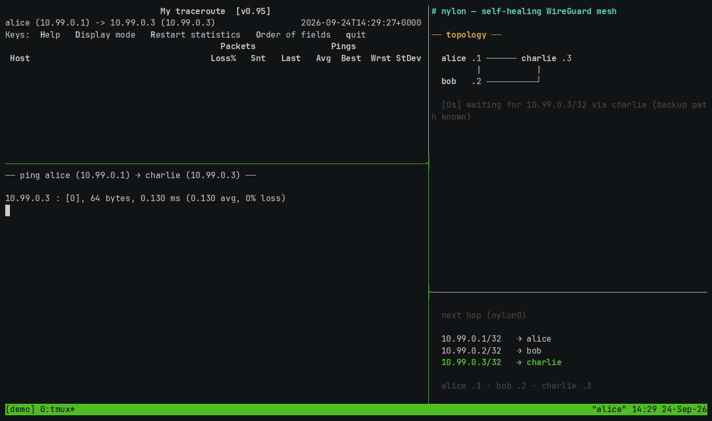

# nylon

> [!IMPORTANT]
> **This is a hard fork of [encodeous/nylon](https://github.com/encodeous/nylon).** It is not
> affiliated with the upstream project, and upstream releases, documentation and support channels do
> not cover it. On top of upstream, this fork adds:
>
> - **AmneziaWG 2.0 traffic obfuscation** — the vendored `polyamide/` device tree speaks the AWG 2.0
>   wire format (`jc`/`jmin`/`jmax`, `s1`–`s4`, `h1`–`h4`, `i1`–`i5`), driven by a mesh-wide `obf`
>   profile plus per-node protocol templates.
>   → [Traffic Obfuscation](https://arsolitt.github.io/nylon-docs/guides/obfuscation/)
> - **Runtime dynamic prefixes (`prefixes.d`)** — external writers drop JSON announce files into a
>   watched directory; the daemon applies and withdraws prefixes without a config reload or restart.
>   → [Dynamic Prefixes](https://arsolitt.github.io/nylon-docs/reference/dynamic-prefixes/)
> - **`nylon-lb`** — a Kubernetes LoadBalancer controller that allocates VIPs, binds them and announces
>   them into the mesh. Named pools are selected per Service with the `nylon.io/lb-pool` annotation and
>   scoped with `--lb-class`.
>   → [Kubernetes LoadBalancer](https://arsolitt.github.io/nylon-docs/guides/nylon-lb/)
> - **`nylon-genesis`** — an obfuscation-parameter generator that emits complete AWG 2.0 profiles
>   (central profile + per-node templates).
>   → [Config Genesis](https://arsolitt.github.io/nylon-docs/guides/genesis/)
>
> Fork documentation: **[arsolitt.github.io/nylon-docs](https://arsolitt.github.io/nylon-docs/)** ·
> upstream project: [github.com/encodeous/nylon](https://github.com/encodeous/nylon)
> ([docs](https://nylon.jq.ax)).

Nylon is a self-healing WireGuard mesh that routes around failures. If a link goes down, nylon reroutes traffic through the next-best path in seconds. No manual intervention, no central coordination servers, just like how a real network should be :)

Under the hood, nylon implements the [Babel routing protocol (RFC 8966)](https://datatracker.ietf.org/doc/html/rfc8966) on top of a [modified wireguard-go](https://github.com/Arsolitt/nylon/tree/main/polyamide), using measured latency as the routing metric. 

Nylon targets under 10 seconds of convergence time after a link failure, as you can see in the demo below.

### Main Features
- **Multi-hop Routing**: traffic flows through the lowest-latency path across your mesh. Unlike Tailscale, Nebula, or ZeroTier, nodes don't need to be directly reachable from each other. Nylon forwards through intermediate hops automatically.
- **No Coordination Server**: no SaaS dependency, no single control-plane. Nodes exchange routes directly over the same WireGuard tunnel that carries your data.
- **Single Binary, Single Port**: one statically-linked daemon binary, one UDP port (`57175`), one YAML config. That's it. Optional companion tools ship separately: `nylon-lb` and `nylon-genesis`.
- **WireGuard Client Compatibility**: on meshes running the vanilla compatibility profile, connect stock WireGuard clients (iOS, Android, Windows) with zero extra software, and let mobile clients roam between gateways seamlessly. Obfuscated (AmneziaWG) profiles change the handshake format, so stock clients cannot join those meshes.
- **Native WireGuard Speeds**: the data-plane runs entirely in `wireguard-go` (polyamide), so forwarded traffic stays on the WireGuard data path with no extra proxy hop.

## Getting Started

Download the latest release binary from the [releases page](https://github.com/Arsolitt/nylon/releases), then head to the [docs](https://arsolitt.github.io/nylon-docs/) for setup instructions.

> **[Read the full documentation at arsolitt.github.io/nylon-docs](https://arsolitt.github.io/nylon-docs/)**
> includes the configuration reference, guides for connecting WireGuard clients, traffic obfuscation, Kubernetes load balancing, port forwarding, and comparisons with Tailscale/Nebula.

Sample systemd service and launchctl plist files can be found under the [`example/`](example/) directory.

> [!NOTE]
> **Stability:** This fork is maintained and daily-driven by [Arsolitt](https://github.com/Arsolitt) on Linux and macOS. The routing protocol has an [extensive test suite](https://github.com/Arsolitt/nylon/blob/main/core/router_test.go) and integration tests with simulated network conditions. The config format may still change between releases.
>
> **Security:** Obfuscation reshapes handshake packets on the wire — sizes, type words and padding — while the cryptography and key exchange stay vanilla WireGuard. All nylon control traffic (route updates, probes) is sent inside the encrypted WireGuard tunnel. Report security concerns via [GitHub issues](https://github.com/Arsolitt/nylon/issues).
>
> **Windows:** The Windows client has known issues. For now, I recommend connecting Windows machines as [passive WireGuard clients](https://arsolitt.github.io/nylon-docs/guides/wg-clients/) via a Linux/macOS gateway.
>
> Bugs and feature requests welcome via [GitHub issues](https://github.com/Arsolitt/nylon/issues).

---

Built with sweat and tears (thankfully no blood)

`nylon` is not an official WireGuard project, and WireGuard is a registered trademark of Jason A. Donenfeld.
