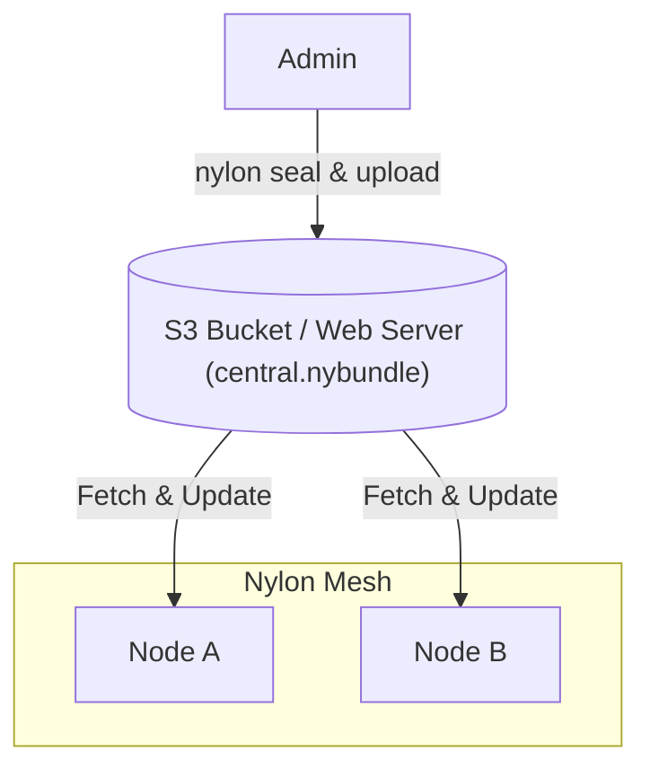

import { Steps } from '@astrojs/starlight/components';

Nylon's distribution system allows you to manage network topology from a central source using signed and encrypted "bundles".



:::caution
Despite being called a "public" key, the distribution key also acts as the shared secret for decrypting your network config. To keep your internal network structure private, only share this key with the nodes in your network.
:::

<Steps>

1. ### Generate a Distribution Keypair

   First, generate a keypair specifically for distribution (separate from node keys).

   ```bash
   nylon key > dist.key 2> dist.pub
   ```

2. ### Seal your Configuration

   Sign and encrypt your `central.yaml` into a `.nybundle` file.

   ```bash
   nylon seal -c central.yaml -k dist.key -o central.nybundle
   ```

3. ### Publish the Bundle

   Host `central.nybundle` on any HTTP/HTTPS server (e.g., GitHub Pages, S3, or Nginx).

4. ### Configure Nodes

   #### Initial Bootstrap (`node.yaml`)
   Nodes fetch their first central config using the `dist` block:

   ```yaml title="node.yaml"
   dist:
     url: "https://your-server.com/central.nybundle"
     key: "<contents-of-dist.pub>"
   ```

   The `dist` block in `node.yaml` is bootstrap-only: it is consulted only when `central.yaml` does not exist yet. Afterwards it is ignored, and updates flow solely from the `dist` block in `central.yaml`; a corrupt `central.yaml` is not replaced from `node.yaml`.

   #### Automatic Updates (`central.yaml`)
   Once bootstrapped, nodes poll the repositories defined in `central.yaml`:

   ```yaml title="central.yaml"
   dist:
     key: "<contents-of-dist.pub>"
     repos:
       - "https://your-server.com/central.nybundle"
   ```

   Nylon polls for updates every 10 seconds, but applies a bundle only when its timestamp is strictly newer than the active config. `nylon seal` rewrites that timestamp to the sealing host's wall clock, so each seal is newer by construction; re-uploading an older bundle is ignored, and clock skew on the sealing host can block rollout.

</Steps>

## Key rotation

When `dist` is configured, `dist.key` must be set to a nonzero public key. To rotate it, put the new public key in `central.yaml` and sign that bundle with the old private key. That transition seal deliberately logs the warning `bundled public key differs from the signing key, check if this is intended!`, because the bundle is sealed with the old key (so old-key nodes can open it) while already carrying the new `dist.key`. After nodes apply the bundle, sign subsequent updates with the new private key; seals with the new key no longer warn.
